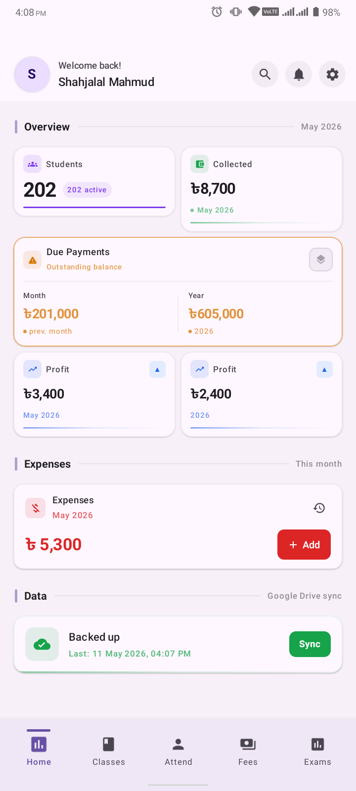
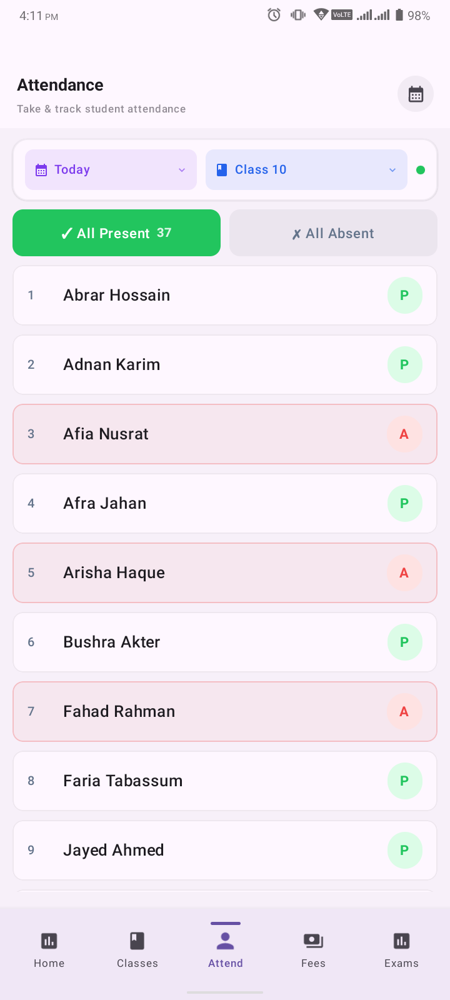
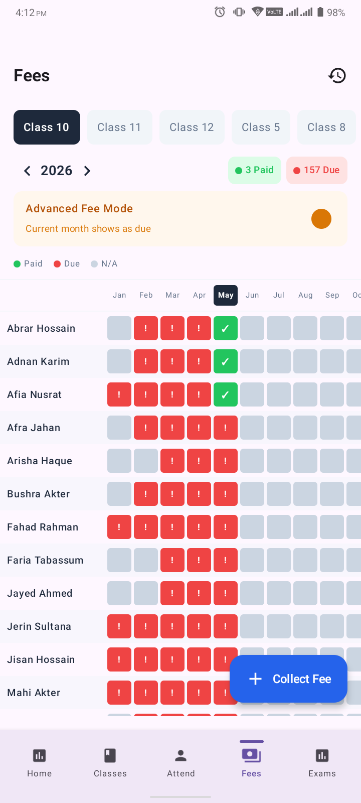

# Amar Batch - Teacher Batch Management App

<div align="center">


# Amar Batch

### A silent assistant for teachers — simple, reliable, and respectful of their time.

[]()
[]()
[]()
[]()
[]()

### 🎯 Real Product • 💰 Revenue Generating • 👨‍💻 Built Solo

</div>

---

# ⚠ IMPORTANT NOTICE

## Amar Batch is NOT open source.

This repository exists for:

- product showcase,
- architecture demonstration,
- engineering documentation,
- UX philosophy,
- and technical case-study purposes only.

The **production source code is private and proprietary**.

Unauthorized copying, redistribution, reverse engineering, or commercial reuse is strictly prohibited.

---

# 📱 What is Amar Batch?

**Amar Batch** is a production Android app built for Bangladeshi private teachers, home tutors, and small coaching batch owners.

It helps teachers manage:

- ✅ Attendance
- ✅ Tuition fees
- ✅ Exams & marks
- ✅ Parent communication
- ✅ Student records
- ✅ Offline data backup

—all from a simple mobile app designed specifically for non-technical teachers.

The app is fully optimized for:

- low internet environments,
- fast daily workflows,
- and simple real-world usage.

---

# 🎯 Product Vision

Most teachers in Bangladesh still manage their batches using:

- notebooks,
- diaries,
- Excel sheets,
- or memory.

Amar Batch replaces that chaos with a reliable offline-first system that takes less than a minute to use daily.

> “Just open, mark, and close.”

That philosophy drives the entire product.

---

# 🚀 Product Status

| Status             | Details                   |
| ------------------ | ------------------------- |
| Product Stage      | Active Beta               |
| Revenue Status     | Monetized                 |
| Distribution       | Manual APK Distribution   |
| Platform           | Android                   |
| Primary Market     | Bangladesh                |
| Architecture       | Clean Architecture + MVVM |
| Developer          | Solo Developer            |
| Backend Dependency | Minimal                   |
| Offline Capability | Full Offline Support      |

---

# 💰 Monetization

Amar Batch is a real commercial product.

### Current Pricing

| Plan                   | Price      |
| ---------------------- | ---------- |
| Single Teacher License | ৳999/year  |
| Multi Batch License    | ৳1499/year |

### Current Distribution Strategy

- Manual APK distribution
- Direct teacher onboarding
- Subscription-based licensing
- Preparing for Google Play launch

---

# 🏗 Technical Highlights

| Area                 | Technology                |
| -------------------- | ------------------------- |
| UI Framework         | Jetpack Compose           |
| Language             | Kotlin                    |
| Architecture         | Clean Architecture + MVVM |
| Local Database       | Room                      |
| Dependency Injection | Hilt                      |
| Async Operations     | Coroutines + Flow         |
| Background Tasks     | WorkManager               |
| SMS System           | Native Android SMS APIs   |
| Backup System        | Google Drive              |
| Offline Capability   | Full Offline-first        |
| Database Design      | 17 Normalized Tables      |

---

# 📸 Screenshots

| Dashboard                                 | Attendance                                          | Fee Collection                            |
| ----------------------------------------- | --------------------------------------------------- | ----------------------------------------- |
|  |  |  |

### More Screens

- Student Management
- Calendar Attendance
- SMS Settings
- Backup & Restore
- Exam Tracking
- Profit Summary

📂 Full gallery available in [`/screenshots`](./screenshots/)

---

# 🎥 Demo Videos

| Demo                  | Description               |
| --------------------- | ------------------------- |
| `quick_demo.mp4`      | 1-minute product overview |
| `attendance_demo.mp4` | Attendance workflow       |
| `fee_demo.mp4`        | Fee collection process    |
| `sms_demo.mp4`        | SMS notification system   |

📂 Videos available in [`/videos`](./videos/)

---

# 📦 APK Download

Beta APK releases are available inside:

```bash
/releases/
```

### Current Release

```bash
releases/
├── amar-batch-beta-v1.apk
├── RELEASE_NOTES.md
└── INSTALLATION_GUIDE.md
```

### Installation Notes

- Android only
- Manual installation required
- Unknown sources permission needed
- Intended for testing/demo purposes

---

# 🔒 Why Private Source?

Many people ask:

> “Why is the source code not public?”

The answer is simple:

Amar Batch is a **commercial proprietary product**.

This repository exists to showcase:

- architecture,
- engineering decisions,
- UX philosophy,
- system design,
- and product thinking.

The production source code is intentionally private.

This allows the product to remain commercially sustainable while still showcasing the engineering and design process publicly.

---

# 🧠 Engineering Philosophy

Amar Batch prioritizes:

- simplicity over complexity,
- speed over visual noise,
- offline reliability over cloud dependency,
- and maintainability over over-engineering.

### Core Product Principles

- Minimal cognitive load
- Fast data entry
- Offline-first UX
- Teacher-friendly workflows
- Predictable navigation
- Stable architecture
- Long-term maintainability

---

# 🏛 Repository Structure

```bash
amar-batch-showcase/
│
├── README.md
├── SHOWCASE.md
├── FAQ.md
├── SUPPORT.md
├── CONTRIBUTING.md
├── CODE_OF_CONDUCT.md
├── CHANGELOG.md
├── ROADMAP.md
├── SECURITY.md
├── NOTICE.txt
│
├── releases/
│   ├── amar-batch-beta-v1.apk
│   ├── RELEASE_NOTES.md
│   └── INSTALLATION_GUIDE.md
│
├── legal/
│   ├── PRIVACY_POLICY.md
│   ├── TERMS_OF_SERVICE.md
│   ├── DISCLAIMER.md
│   └── LICENSE.md
│
├── docs/
│   ├── OVERVIEW.md
│   ├── PROBLEM_STATEMENT.md
│   ├── SOLUTION.md
│   │
│   ├── architecture/
│   │   ├── ARCHITECTURE_OVERVIEW.md
│   │   ├── DATA_FLOW_DIAGRAM.md
│   │   ├── OFFLINE_FIRST_STRATEGY.md
│   │   └── TECH_STACK.md
│   │
│   ├── database/
│   │   ├── SCHEMA_OVERVIEW.md
│   │   ├── ENTITY_RELATIONSHIPS.md
│   │   ├── TABLE_STRUCTURES.md
│   │   └── DESIGN_DECISIONS.md
│   │
│   ├── features/
│   │   ├── student_management.md
│   │   ├── attendance_tracking.md
│   │   ├── fee_management.md
│   │   ├── exam_tracking.md
│   │   ├── sms_system.md
│   │   └── backup_restore.md
│   │
│   ├── ui_ux/
│   │   ├── USER_FLOW.md
│   │   ├── SCREEN_STRUCTURE.md
│   │   └── DESIGN_PHILOSOPHY.md
│   │
│   └── technical/
│       ├── OFFLINE_SYNC_STRATEGY.md
│       ├── BACKGROUND_WORKERS.md
│       ├── LICENSING_SYSTEM.md
│       └── SMS_QUEUE_SYSTEM.md
│
├── screenshots/
├── videos/
├── assets/
├── architecture_diagrams/
├── user_guide/
└── business/
```

---

# 📚 Documentation

## Product & Business

- [Overview](./docs/OVERVIEW.md)
- [Problem Statement](./docs/PROBLEM_STATEMENT.md)
- [Solution](./docs/SOLUTION.md)
- [Monetization Strategy](./business/MONETIZATION_STRATEGY.md)
- [Competitor Analysis](./business/COMPETITOR_ANALYSIS.md)

---

## Architecture & Engineering

- [Architecture Overview](./docs/architecture/ARCHITECTURE_OVERVIEW.md)
- [Offline-first Strategy](./docs/architecture/OFFLINE_FIRST_STRATEGY.md)
- [Tech Stack](./docs/architecture/TECH_STACK.md)
- [Database Schema](./docs/database/SCHEMA_OVERVIEW.md)

---

## UX & Product Design

- [Design Philosophy](./docs/ui_ux/DESIGN_PHILOSOPHY.md)
- [User Flow](./docs/ui_ux/USER_FLOW.md)
- [Screen Structure](./docs/ui_ux/SCREEN_STRUCTURE.md)

---

## User Guides

- [Getting Started](./user_guide/getting_started.md)
- [Attendance Guide](./user_guide/attendance_guide.md)
- [Fee Management](./user_guide/fee_management_guide.md)
- [SMS Guide](./user_guide/sms_guide.md)

---

# 🔐 Intellectual Property

## ⚠ Amar Batch is NOT open source.

This repository is for:

- documentation,
- architecture showcase,
- UI/UX demonstration,
- and product presentation purposes only.

### Restrictions

You may NOT:

- copy the application,
- clone business logic,
- reuse branding,
- redistribute APKs,
- reverse engineer proprietary systems,
- or create commercial derivatives.

All rights reserved.

---

# 👨‍💻 About the Developer

**MD SHAHAJALAL MAHMUD**

- 3rd Year CSE Student
- Android Engineer
- Product Builder
- Founder of Appriyo

### Focus Areas

- Android Engineering
- Offline-first Systems
- Mobile Product Design
- Real-world SaaS Products
- UX Simplification

---

# 🌐 Links

| Platform     | Link                                             |
| ------------ | ------------------------------------------------ |
| Product Page | https://appriyo.com/app/amarbatch                |
| Portfolio    | https://shahajalalmahmud.netlify.app/            |
| LinkedIn     | https://www.linkedin.com/in/md-shahajalal-mahmud |
| GitHub       | https://github.com/shahjalal-mahmud              |

---

# 📞 Contact

| Type         | Details                |
| ------------ | ---------------------- |
| Email        | mahmud.nubtk@gmail.com |
| Product      | Amar Batch             |
| Organization | Appriyo                |

---

# ⭐ Final Note

Amar Batch is not a tutorial project.

It is a real product solving real operational problems for real teachers.

This repository demonstrates:

- product thinking,
- software architecture,
- offline-first engineering,
- UX simplification,
- and commercial software development by a solo student developer.

---

<div align="center">

### Built with Kotlin, Jetpack Compose, Room & real-world feedback from teachers.

**Made with ❤️ for Bangladeshi Teachers**

</div>
